# FlipDot34

Controller for the flip-dot display with 34-pin connector. For example produced by Lawo-Luminator-Europa Mark IV Industries GmbH.

Version 28x19
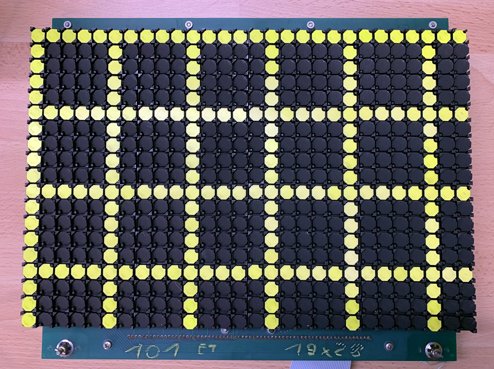
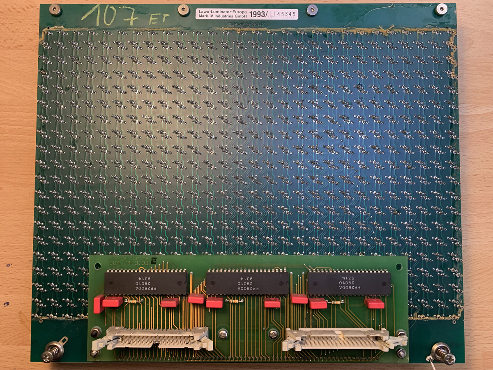

Version 28x24 with LED lights
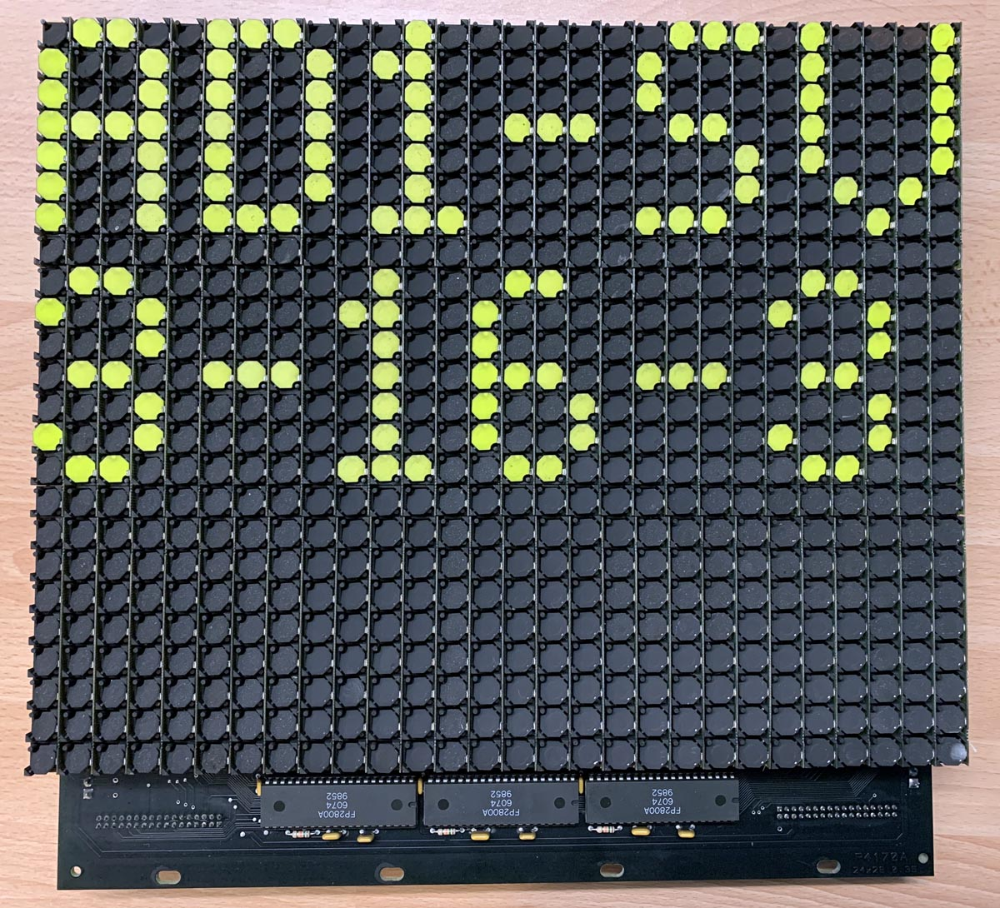
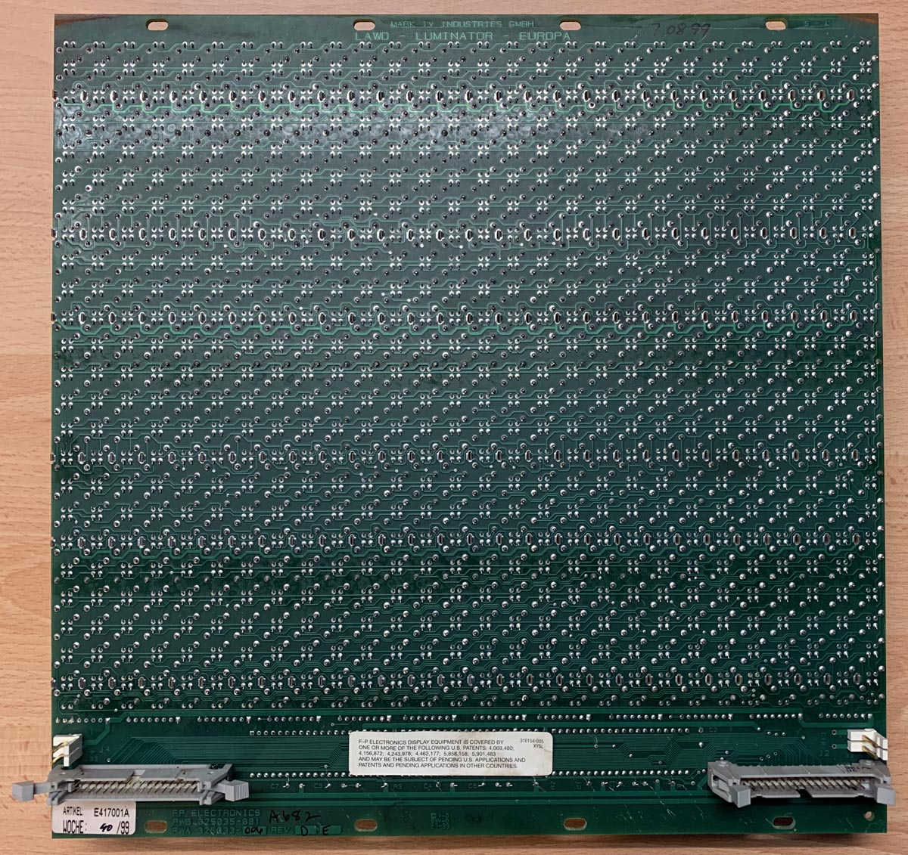

## Connector Pinout
| Pin |  Function | Pin |  Function |
| --- | ------ | --- | ------ |
| 1   | GND  | 2   | GND  | 
| 3   | GND  | 4   | GND  | 
| 5   | 5V  |  6   | 5V  | 
| 7   | A0-X | 8 | DATA-X |
| 9   | A1-X | 10 | ENABLE-Y-SET |
| 11   | A2-X | 12 | ENABLE-Y-RESET |e
| 13   | B0-X | 14 | ENABLE-X-1 |
| 15   | B1-X | 16 | ENABLE-X-2 |
| 17   | A0-Y | 18 | ENABLE-X-3 |
| 19   | A1-Y | 20 | ENABLE-X-4 |
| 21   | A2-Y | 22 | ENABLE-X-5 |
| 23   | B0-Y | 24 | ENABLE-X-6 |
| 25   | B1-Y | 26 | ENABLE-X-7 |
| 27   | n/c | 28 | ENABLE-X-8 |
| 29   | 24V  |  30   | 24V  | 
| 31   | GND  | 32   | GND  | 
| 33   | GND  | 34   | GND  | 

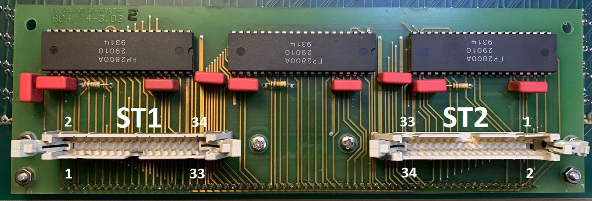

## Chaining Multiple Displays in a Row

Driver board has two connectors. The output connector ST2 mostly duplicates 1:1 singnals from the input ST1 but ENABLE-X- signals are shifted. 

| Pin | INPUT  ST1 |  OUTPUT ST2 |
| --- | ---------- | ---------- |
| 13  | ENABLE-X-1 | ENABLE-X-2 |
| 15  | ENABLE-X-2 | ENABLE-X-3 |
| 17  | ENABLE-X-3 | ENABLE-X-4 |
| 19  | ENABLE-X-4 | ENABLE-X-5 |
| 21  | ENABLE-X-5 | ENABLE-X-6 |
| 23  | ENABLE-X-6 | ENABLE-X-7 |
| 25  | ENABLE-X-7 | ENABLE-X-8 |
| 17  | ENABLE-X-8 | ENABLE-X-1 |

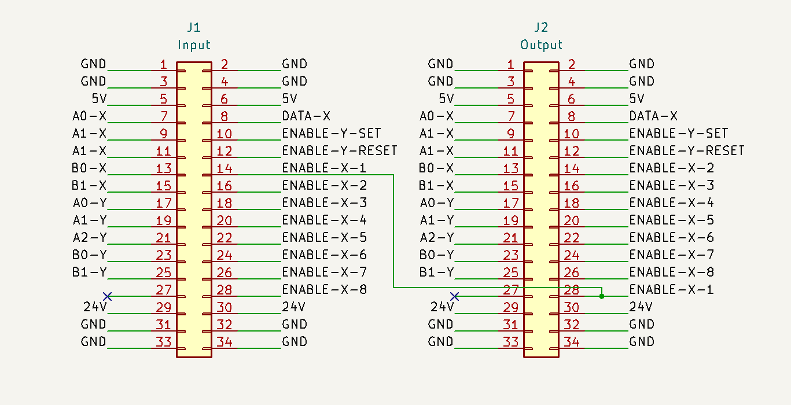

The ENABLE input of FP2800 X Driver is always connected to ENABLE-X-1 connector pin. For example when ENABLE-X-3 is set to HIGH the first two displays in a row will ignore it, but after two decrements the signal will be applied to ENABLE-X-1 ST1 of the third display matrix and will activate it.

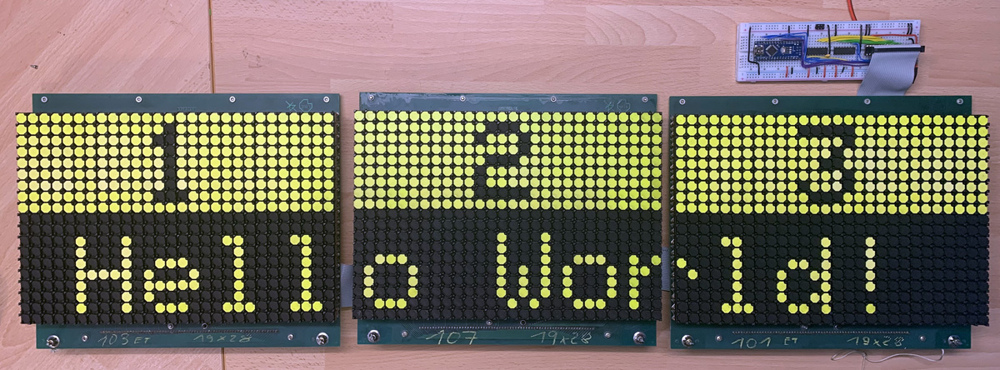

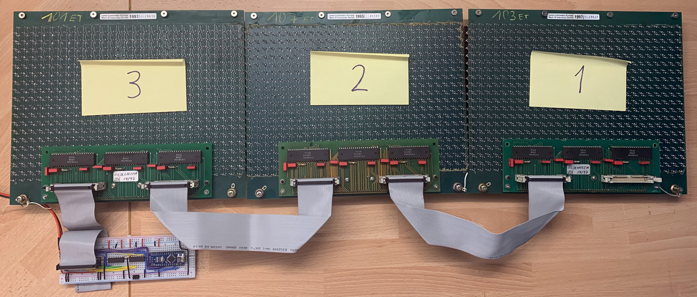

## Driver Boards

### Prototype

This prototype uses Arduino Nano and two 74HC595 shift registers to control up to 6 matrices. By adding another 595 it can control up to 8 display matrices.

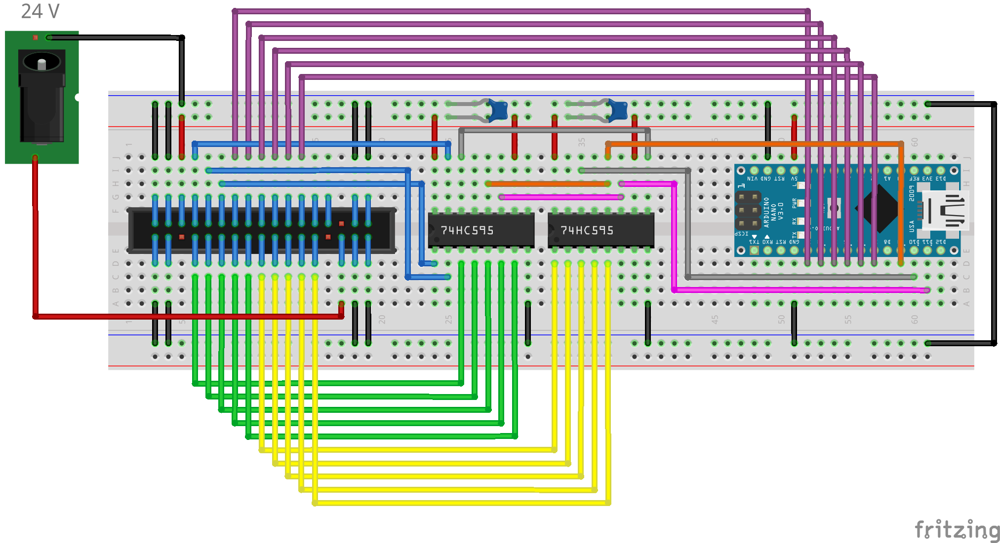

### FlipDot34Nano

Driver board with Arduino Nano and three 74HC595 shift registers opitmized for single-sided PCB that can be milled with 3018 CNC. 3 digital pins are used for controlling shift registers, analog pins A4 and A5 can be used to receive commands over I2C. Pins A0-A2 connected to DIP switches choosing I2C address.

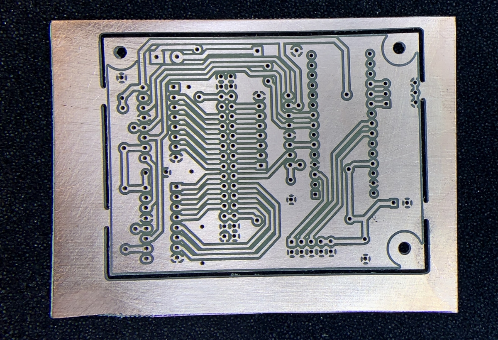
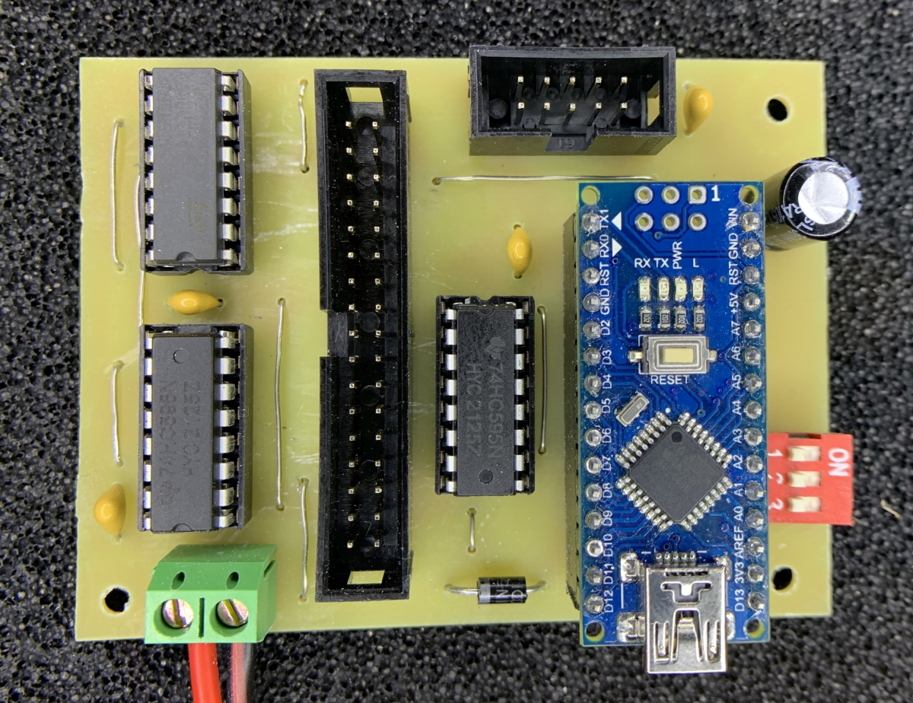

Schematic in KiCad 6 format checked in under .\Driver-boards\FlipDot34Nano\schematic\FlipDot34Nano

---
All trademarks, logos and brand names are the property of their respective owners. All company, product and service names are for identification purposes only. 

It's a hobby project; I am not affiliated with any  company producing flip-dot displays.

